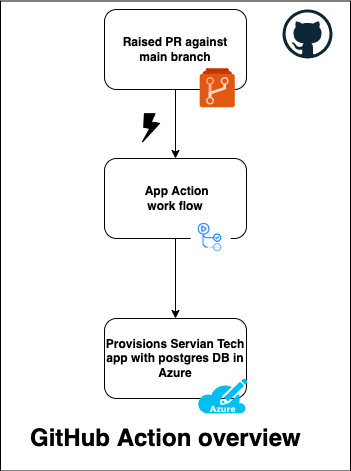
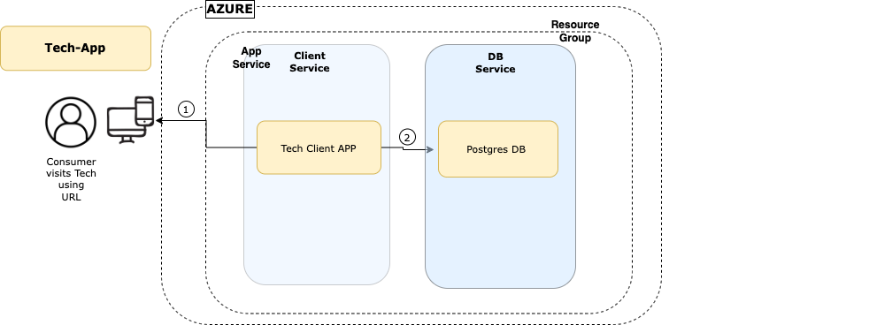

# Servian-Technical-Challenge-App


This Terraform module demonstrates deployment of servian Technical Challenge App to Azure

- Contents of this README:
  1. **Provisioned Infrastructure Details**
  2. **Basic Requirements**
  3. **Providers**
  4. **Modules**
  5. **Resources**
  6. **Inputs**
  7. **High level architectural overview of deployment**
  8. **Deployment**
      - *GitHub Actions (Automated Process)*
      - *Manual Deployment*. 
  9. **Technical Challenge URL**
  10. **Contact / Getting help**
  11. **License**
---
## 1. Provisioned Infrastructure Details

- PostgreSQL database
- TechChallengeApp 
---
## 2. Requirements

| Name | Version |
|------|---------|
| <a name="requirement_terraform"></a> [terraform](#requirement\_terraform) | >= 0.14.0 |
| <a name="requirement_azurerm"></a> [azurerm](#requirement\_azure) | > 3.0.1 |
---
## 3. Providers

| Name | Version |
|------|---------|
| <a name="provider_azurerm"></a> [azurerm](#provider\_azure) |  > 3.0.1 | |


---
## 4. Resources

| Name | Type |
|------|------|
[azurerm_resource_group](https://registry.terraform.io/providers/hashicorp/azurerm/latest/docs/resources/resource_group) | resource |
| [azurerm_postgresql_server](https://registry.terraform.io/providers/hashicorp/azurerm/latest/docs/resources/postgresql_server) | resource |
| [azurerm_postgresql_database](https://registry.terraform.io/providers/hashicorp/azurerm/latest/docs/resources/postgresql_database) | resource |
| [azurerm_app_service_plan](https://registry.terraform.io/providers/hashicorp/azurerm/latest/docs/resources/app_service_plan) | resource |
| [azurerm_app_service](https://registry.terraform.io/providers/hashicorp/azurerm/latest/docs/resources/app_service) | resource |

---
## 5. Inputs

| Name | Description | Type | Default | Required |
|------|-------------|------|---------|:--------:|
| <a name="input_rg-name"></a> [rg-name](#input\_azurerm\_api) | The Resource Group name | `string` | `"servian_app_rg"` | yes |
| <a name="input_location"></a> [location](#input\_azurerm\_app\_name) | The Resource Group Location | `string` | `"Australia East"` | yes |
| <a name="input_postgresql-server-name"></a> [postgresql-server-name](#input\_azurerm\_domain\_name) | The postgresql name | `string` | `"servianpostgresqlserver"` | yes |
| <a name="input_postgresql-db-name"></a> [postgresql-db-name](#input\_azurerm\_domain\_name) | The name of the database | `string` | `"servian_postgressql_db"` | yes |
| <a name="input_service-plan-name"></a> [service-plan-name](#input\_azurerm\_org\_name) | service plan name | `string` | `"serviangtdapp"` | yes |
| <a name="input_administratorlogin"></a> [administratorlogin](#input\_azurerm\_app\_region) | User login  | `string` | `"psuser"` | yes |
| <a name="input_listenhost"></a> [listenhost](#input\_listenhost) | The listenhost of the app | `string` | `0.0.0.0` | yes |
| <a name="input_docker_image"></a> [docker\_image](#input\_docker_image) | Docker image to use | `string` | `servian/techchallengeapp:latest` | yes |
| <a name="input_docker_image_tag"></a> [docker_image_tag](#input\_docker_image_tag) | Docker image tag to use | `string` | `latest` | yes |

# 6. High level architectural overview of deployment


| *GitHub Action overview* | *deployment-overview* |
|------|------|
|  | 

# 7. Deployment
### GitHub Actions (Automated Process) -- Recommended
- Whenever new code is merged to the main branch then the GitHub action will be triggered automatically.
- On successful build completion, Tech Challange App and postgres DB instance will be provisioned in Azure cloud.
- The secret variables are configured in Github
- Full workflow about provisioning Tech Challange App and postgres DB is available in the [app-actions.yml](.github/workflows/app-actions.yml)

### Manual Deployment

### Installing Terraform
Terraform should be installed on your system. [Instructions available here](https://learn.hashicorp.com/tutorials/terraform/install-cli). Once installed check the version, it should be at least `0.14.2` or higher:

```shell
$ terraform version
Terraform v1.2.8
```
### Initalizing Terraform
Next Terraform needs to download the necessary provider plugins, modules and set up the initial (empty) state. Start by executing

```shell
$ terraform init
```
### terraform plan 
Now you are ready to run terraform [plan](https://www.terraform.io/docs/commands/plan.html) with secrets vraiables :

```shell
$ terraform plan -var="administratorloginpassword=${{var.administratorloginpassword}}" -var="client_id=${{var.client_id}}" -var="client_secret=${{var.client_secret}}" -var="tenant_id=${{var.tenant_id}}" -var="subscription_id=${{var.subscription_id}}" -out=tfplan
```
Terraform will calculate an execution plan and display all the actions it needs to perform to deploy app and components.

### terraform apply
The [apply](https://www.terraform.io/docs/commands/apply.html) step will kick off provisioning of all resources:

```shell
$ terraform apply -auto-approve "tfplan"
```

This typically
takes between 5-15 minutes. The majority of the time is spend waiting on the PostgreSQL database to become available for use.
Once the apply step finishes you should see something like below:

```shell
Apply complete! Resources: 5 added, 0 changed, 0 destroyed..
```
## terraform destroy
You can remove all created resources using the terraform [destroy](https://www.terraform.io/docs/commands/destroy.html) command

```shell
$ terraform destroy
```
# 8. Technical Challenge URL

To Access Technical Challenge URL depolyed in azure:

```shell
https://serviangtdapp.azurewebsites.net
```
# 9. Contact / Getting help
Please reach me at  [Sanju Khetavath](mailto:rathodsanju399@gmail.com)

# 10. License
[License](./LICENSE) is MIT